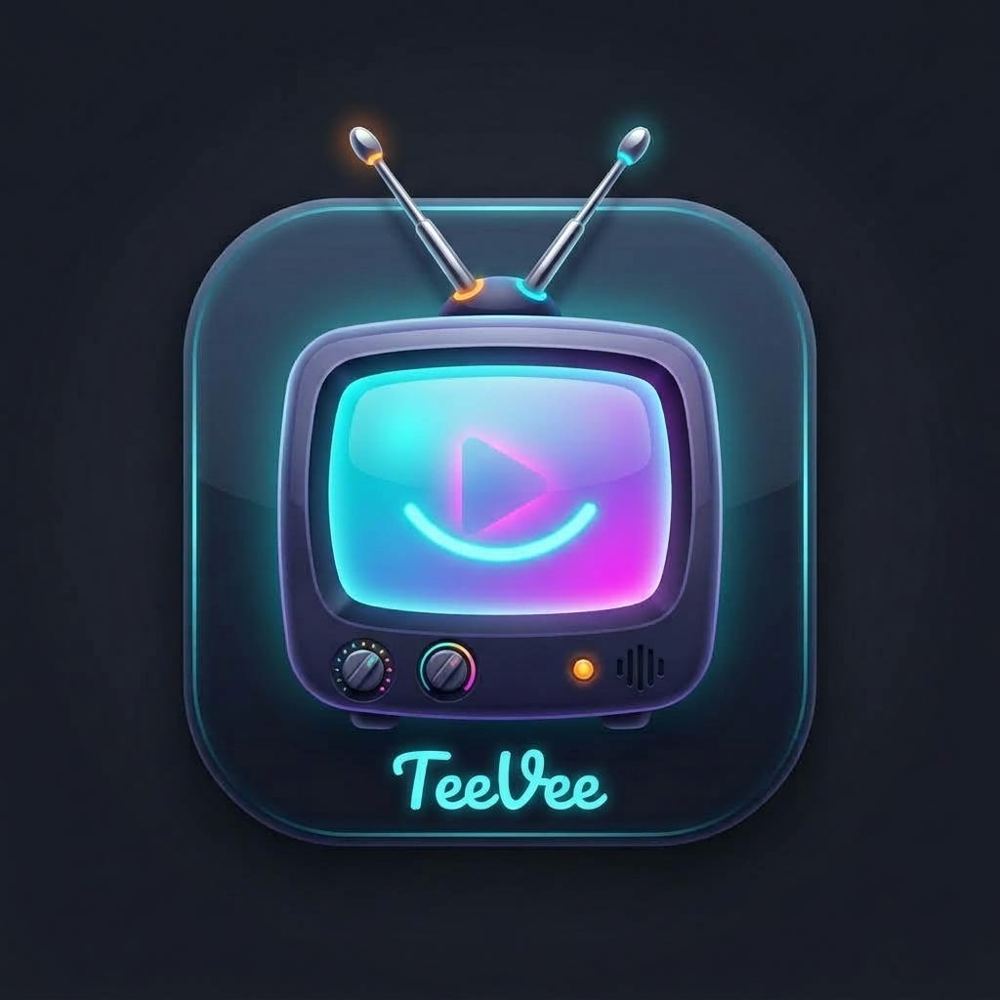
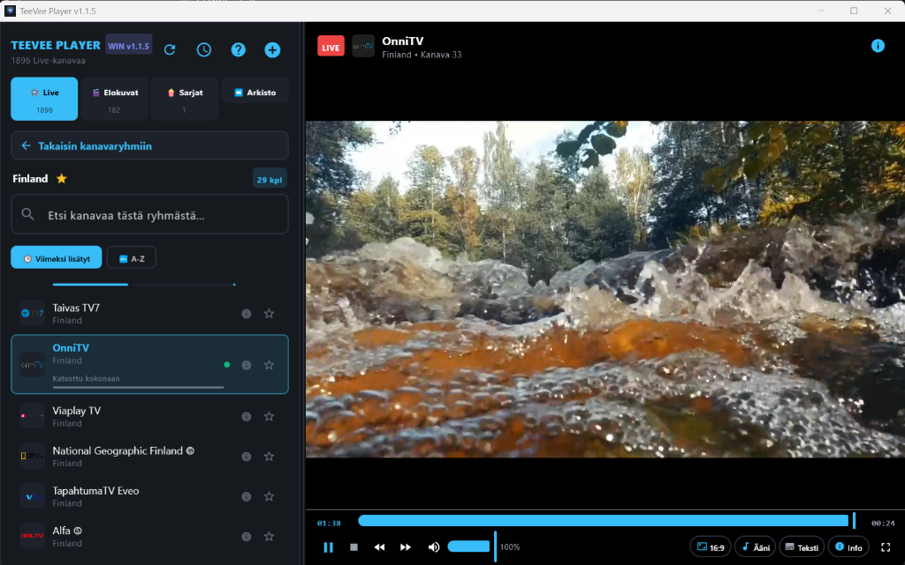
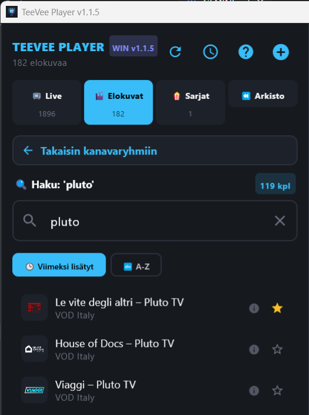
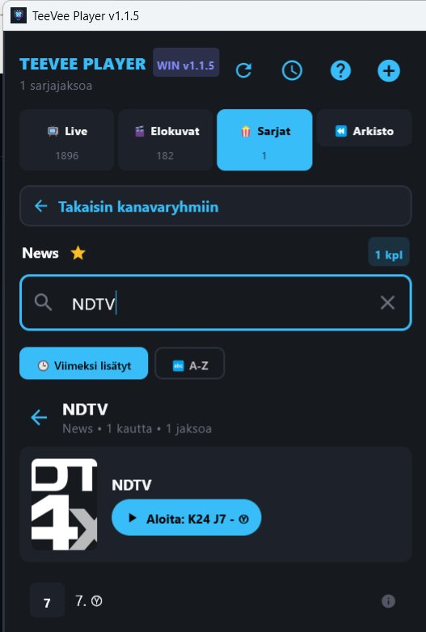

# TeeVee Player

### The fast, sleek, standalone desktop IPTV player for Windows 10 & 11

 

[📥 **Download Latest Windows Installer (.msi)**](https://github.com/borgjanne-cmd/TeeVee-Player/releases/latest) &nbsp;&bull;&nbsp;
[🌐 **Official Website**](https://teevee-player.netlify.app) &nbsp;&bull;&nbsp;
[📝 **Changelog**](CHANGELOG.md) &nbsp;&bull;&nbsp;
[🇫🇮 **Suomeksi**](KAYTTOOHJE.md)

---

## 📸 Screenshots

### 📺 Live TV & Main Player View
Featuring dark glassmorphism styling, instant channel surfing, and real-time playback controls:

 

### 🎬 Movies (VOD) & 🍿 TV Series Guide
Blazing-fast category browsing and episode selectors with automatic watch-history tracking:

| 🎬 Movies (VOD) Search | 🍿 TV Series & Episodes |
|:---:|:---:|
|  |  |

---

## ✨ Key Features

- **⚡ Native Desktop Performance:**
  - Built with **Kotlin Multiplatform + Jetpack Compose for Desktop**.
  - Powered by **LibVLC 3.0.24 (FFmpeg 8)** with native GPU hardware acceleration.
  - Starts up instantly with high-performance SQLite caching (WAL mode) capable of handling playlists with over 50,000 channels.

- **📺 Complete IPTV & Media Protocol Support:**
  - Seamlessly streams **HLS (.m3u8), MPEG-TS, RTMP, RTSP**, and direct video files (**MP4, MKV, AVI**).
  - Handles variable bitrates, live DVR buffers, and network reconnects automatically.

- **⏪ 7-Day Catchup TV (Arkisto / Timeshift):**
  - Watch previously aired programs on supported channels with full time-shift and seek controls (supports Xtream Codes & Flussonic protocols).

- **📑 Smart Multi-Playlist Management:**
  - Add unlimited playlists via **M3U / M3U8 URLs, local playlist files, or Xtream Codes API**.
  - Instant one-click switching between playlists directly from the top bar.
  - Automatic background synchronization keeping channel lists and EPG up to date.

- **📅 Electronic Program Guide (EPG):**
  - Integrated XMLTV guide showing currently playing and upcoming shows.
  - High-speed fuzzy search across all channels, categories, and program titles.

- **💬 Multi-Track Audio & OpenSubtitles Integration:**
  - Switch between multi-language audio streams and embedded subtitle tracks.
  - Integrated **OpenSubtitles.com** search & download with real-time sync adjustment (`±0.25s`, `±0.5s`).

- **🖥️ Desktop-Centric Polish:**
  - One-click Fullscreen (`F11` / `F`) and Compact mini-player mode (`F10`).
  - Automatic Windows **sleep & screensaver prevention** during video playback (`SetThreadExecutionState`).
  - Aspect ratio cycling (`16:9`, `4:3`, `16:10`, `Fill`, `Default`).
  - Comprehensive keyboard shortcuts for living-room or desktop control.

- **🔒 100% Private & Standalone:**
  - **No external dependencies:** Fully standalone package with embedded custom JRE runtime and bundled LibVLC. No separate Java or VLC installations needed!
  - **Your data stays local:** No user tracking, no telemetry, no cloud accounts required. Your playlist credentials and history remain strictly on your machine.

---

## 🛡️ Security & Safe Downloads (VirusTotal Verified)

Because TeeVee Player is an independent open-source project without a costly corporate code-signing certificate, Windows SmartScreen may display an informational alert (*"Windows protected your PC"*) upon first launch.

To ensure complete peace of mind, **every official release package is pre-scanned on VirusTotal**:
- ✅ **100% Clean:** 0/70+ security vendors detect any threat.
- 🛡️ **Verification:** Each GitHub Release note contains a direct link to its clean VirusTotal analysis report.
- 🔓 **To install on Windows:** Click *More info* ➔ *Run anyway*.

---

## ⌨️ Keyboard Shortcuts

| Shortcut | Action |
|:---:|---|
| <kbd>Space</kbd> / <kbd>K</kbd> | Play / Pause |
| <kbd>Left</kbd> / <kbd>J</kbd> | Seek backward 10 seconds |
| <kbd>Right</kbd> / <kbd>L</kbd> | Seek forward 10 seconds |
| <kbd>Up</kbd> | Increase volume (+5%) |
| <kbd>Down</kbd> | Decrease volume (-5%) |
| <kbd>M</kbd> | Toggle Mute |
| <kbd>A</kbd> | Cycle audio tracks |
| <kbd>S</kbd> | Cycle subtitle tracks |
| <kbd>C</kbd> | Cycle aspect ratio (16:9, 4:3, Fill...) |
| <kbd>F11</kbd> / <kbd>F</kbd> | Toggle Fullscreen |
| <kbd>F10</kbd> | Toggle Compact Mini-Player |
| <kbd>Esc</kbd> | Exit fullscreen or dismiss modal dialogs |

---

## 🚀 Getting Started

### 1. Download & Install
1. Head over to the [**Latest GitHub Release**](https://github.com/borgjanne-cmd/TeeVee-Player/releases/latest).
2. Download `TeeVee-Player-<version>.msi`.
3. Double-click to run the installer and launch **TeeVee Player** from your Start menu or desktop shortcut.

### 2. Add Your Playlist
1. On first launch, click **+ Add Playlist** (or try out the preloaded demo channels).
2. Choose your input method:
   - **M3U / M3U8 URL:** Enter your streaming provider's link.
   - **Local File:** Select a `.m3u` or `.m3u8` playlist file from your hard drive.
   - **Xtream Codes:** Enter Server URL, Username, and Password for full Live, VOD, Series & Catchup support.
3. Enjoy your channels with instant search and category browsing!

---

## 🌐 Supported Languages

TeeVee Player automatically detects your Windows system language and allows changing it anytime from the top bar:
- 🇬🇧 **English**
- 🇫🇮 **Suomi**
- 🇸🇪 **Svenska**

---

## 💻 System Requirements

- **Operating System:** Windows 10 (64-bit) or Windows 11 (64-bit)
- **Processor:** Any modern dual-core x64 CPU (Intel / AMD)
- **Memory:** 4 GB RAM (8 GB recommended for heavy 4K streams)
- **Storage:** ~300 MB free disk space
- **Display:** 1280×720 minimum resolution (Full HD or 4K recommended)
- **Network:** Broadband Internet connection for smooth live and VOD streaming

---

## 💬 Contact & Support

Have questions, feedback, or feature suggestions?
- 🌐 **Official Website:** [teevee-player.netlify.app](https://teevee-player.netlify.app)
- ✉️ **Email Support:** [teevee.jannejb@gmail.com](mailto:teevee.jannejb@gmail.com)

 

*Built with [JetBrains Compose Multiplatform](https://www.jetbrains.com/lp/compose-multiplatform/) & [LibVLC / VideoLAN](https://www.videolan.org/).*

